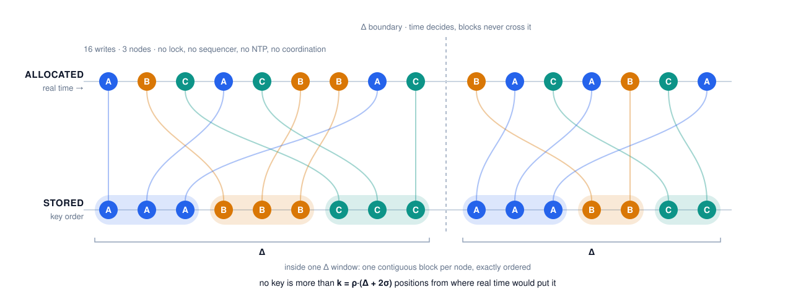

<p align="center">
  <h3 align="center">GUID</h3>
  <p align="center"><strong>k-sorted unique identifiers in lock-free and decentralized manner for Golang applications</strong></p>

  <p align="center">
    <!-- Version -->
    <a href="https://github.com/fogfish/guid/releases">
      
    </a>
    <!-- Documentation -->
    <a href="http://godoc.org/github.com/fogfish/guid">
      
    </a>
    <!-- Build Status  -->
    <a href="https://github.com/fogfish/guid/actions/">
      
    </a>
    <!-- GitHub -->
    <a href="http://github.com/fogfish/guid">
      
    </a>
    <!-- Coverage -->
    <a href="https://coveralls.io/github/fogfish/guid?branch=main">
      
    </a>
  </p>
</p>

---

Package guid implements interface to generate k-sorted unique identifiers in lock-free and decentralized manner for Golang applications.

```
  𝑨[𝒊] ≤ 𝑨[𝒋]   whenever 𝒋 − 𝒊 ≥ 𝒌,    𝒌 = ρ·(Δ + 2σ)
```

<picture>
  <source media="(prefers-color-scheme: dark)" srcset="doc/img/invariant-dark.svg">
  
</picture>

`𝑨` is the stream of identifiers allocated by **every node of the cluster**,
indexed by the real time of allocation. That is the textbook
[k-sorted sequence](https://en.wikipedia.org/wiki/K-sorted_sequence). The
familiar `𝑨[𝒊−𝒌] ≤ 𝑨[𝒊] ≤ 𝑨[𝒊+𝒌]` is its `𝒋 − 𝒊 = 𝒌` case, and no identifier
ever sits more than `𝒌` places from its sorted position. N nodes allocate with
no lock, no sequencer, no NTP and no talk between them, and the stream still
satisfies it.

The key order is total, exact and identical for every reader at every separation. `𝒌` bounds one thing only: how far that order may depart from *wall-clock* order.

|              |                                                                     |
| ------------ | ------------------------------------------------------------------- |
| population   | the cluster's whole allocation stream — every node, no coordination |
| observable A | key order — `bytes.Compare` in the index you already have           |
| observable B | real allocation order — the index `𝒊`                               |
| relation     | `≤` at distance `𝒌` — the two agree beyond `𝒌` places               |
| tolerance    | **0** beyond `𝒌` — the bound is proven and tight, not typical       |
| window       | `𝑾 = Δ + 2σ` of wall clock; in entries, `𝒌 = ρ·𝑾`                   |

So: widen a range scan by `𝑾` and it cannot miss a row; buffer `𝒌` entries and
the stream is fully sorted; restrict `𝑨` to one node and key order *is* allocation
order, exactly, at any rate and under any clock.

**Choose `Δ` by your failover interval, not by a wish for a small `𝒌`.** Since
`𝑾 = Δ + 2σ`, where `σ` is tens of seconds — hardware with no RTC, VMs resuming
from a snapshot, phones back from airplane mode — a smaller `Δ` barely moves
`𝑾`, and it gives up what `Δ` is *for*: inside one `Δ` bucket each node's
identifiers form a single contiguous block, so two writers that overlapped
through a hand-over stay separable by a range scan. `guid.DriftOf(d)` picks the
rung. Proven in [doc/proof.md](doc/proof.md), machine-checked in
[doc/proof.lean](doc/proof.lean), read first in [doc/about.md](doc/about.md).

## Key features

This library aims important objectives:

* **The allocator's location is part of the sort order.** The location outranks the fine fraction of time, so every node's identifiers occupy a contiguous, individually ordered run of the key space. The topology is readable from the keys themselves.
* IDs allocation does not require centralized authority, coordination between nodes, or a synchronized clock.
* IDs are suitable for partial event ordering in distributed environment and helps on detection of causality violation.
* IDs are roughly sortable by allocation order ("time").
* IDs reduce indexes footprints and optimize lookup latency.


## Inspiration

The event ordering in distributed computing is resolved using various techniques, e.g. Lamport timestamps, Universal Unique Identifiers, Twitter Snowflake and many other techniques are offered by open source libraries. `guid` is a Golang port of [Erlang's uid library](https://github.com/fogfish/uid).

All these solution made a common conclusion, globally unique ID is a triple ⟨𝒕, 𝒍, 𝒔⟩: ⟨𝒕⟩ monotonically increasing clock or timestamp is a primary dimension to roughly sort events, ⟨𝒍⟩ is spatially unique identifier of ID allocator so called node location, ⟨𝒔⟩ sequence is a monotonic integer, which prevents clock collisions. The `guid` library addresses few issues observed in other solutions.

Every byte counts when application is processing or storing large volume of events. This library implements fixed size 96-bit identity schema, which is castable to 64-bit under certain occasion. It is about 25% improvement to compare with UUID or similar 128-bit identity schemas (only Twitters Snowflake is 64-bit). The same schema is also offered at 128 bits as an RFC 9562 UUIDv8, `guid.X`, for deployments where interoperability outweighs the footprint.

Most of identity schemas uses monotonically increasing clock (timestamp) to roughly order events. The resolution of clock varies from nanoseconds to milliseconds. We found that usage of timestamp is not perfectly aligned with the goal of decentralized ID allocations. Usage of time synchronization protocol becomes necessary at distributed systems. Strictly speaking, NTP server becomes an authority to coordinate clock synchronization. This happens because schemas uses time fraction ⟨𝒕⟩ as a primary sorting key. In contrast with other libraries, `guid` do not give priority to single fraction of identity triple ⟨𝒕⟩ or ⟨𝒍⟩. It uses dynamic schema where the location fraction has higher priority than time only at particular precision.

**This is what the library exists for.** Inside one drift window the key space is partitioned by allocator: every node's identifiers form a contiguous run, and each run is exactly ordered — never interleaved with another node's. Consider a ring topology with leader-follower hand-over. A leader fails silently; for some interval two nodes believe they own the same range. Under a timestamp-primary schema their writes interleave, and recovering *who wrote what* means carrying the node identity somewhere else and filtering. Here the two nodes land in separate ranges: you scan a node's contribution directly, bound the overlap and reconcile, because the key space itself records the topology.

Neither Snowflake nor UUIDv7 can express this. Snowflake carries a machine id but places it below the *whole* timestamp, so grouping by node survives only within one millisecond. UUIDv7 has no location fraction at all — after the 48-bit millisecond it is entropy. The property is not a matter of tuning; the field has to be positioned to say it.

## Identity Schema

A fixed size of 96-bit is used to implement identity schema

```
  3bit  47 bit - 𝒅 bit         32 bit      𝒅 bit  14 bit
   |-|-------------------|----------------|-----|-------|
   ⟨𝒅⟩        ⟨𝒕⟩                ⟨𝒍⟩         ⟨𝒕⟩     ⟨𝒔⟩
```

↣ ⟨𝒕⟩ is 47-bit UTC timestamp with a resolution of 131 µs — one tick is 2¹⁷ ns. It is derived from the nanosecond UNIX timestamp by shifting it right by 17 bits (`time.Now().UnixNano() >> 17`). The field spans 2⁴⁷ ticks of 2¹⁷ ns — 2⁶⁴ ns, about 584 years — so measured from the UNIX epoch it runs to the year 2555. The effective ceiling is earlier and comes from Go rather than from the schema: `UnixNano` is undefined beyond 2262, so ⟨𝒕⟩ never uses more than 46 of its 47 bits. A deployment that needs a different time base supplies its own ticker with `guid.Clock.WithClock(...)` (or `guid.Unclock.WithClock(...)` for a descending one), which also gives that clock a private ⟨𝒕,𝒔⟩ sequence.

↣ ⟨𝒍⟩ is 32-bits node/allocator identifier. It is allocated randomly to each node using cryptographic random generator or application provided value. The node identity has higher sorting priority than the low bits of the timestamp, which is what makes each allocator's output a contiguous, exactly ordered run of the key space. The random allocation give an application ability to introduce about 65K allocators before it meets a high probability of collisions.

> If ⟨𝒍⟩ is meant to carry topology, assign it rather than randomize it. `guid.Clock`/`guid.Unclock` already carry `CONFIG_GUID_NODE_ID` when a deployment sets it, a random ⟨𝒍⟩ otherwise — distinct allocators either way, but neither one follows topology: a random identity sorts arbitrarily, and an env-provided one is typically fixed per process rather than derived from ring position. Derive ⟨𝒍⟩ from the ring position with `guid.Clock.WithNodeID(...)` when you want the sort order to follow the topology.

↣ ⟨𝒅⟩ is 3 drift bits defines the width Δ of the window inside which ⟨𝒍⟩ outranks time. It shows the value of less important faction of time. The code selects a rung of an eight step ladder that runs from 131 µs to 39 hours, configured on the clock with `guid.Clock.WithDrift(...)` and defaulting to about 4.5 minutes.

**Read Δ as a failover budget, not as a clock-skew budget.** It has to cover the interval between a silent failure and the moment the cluster has converged on a new owner — because that is the interval during which two allocators write to the same range and you need their output kept apart:

| constant                     | Δ       | covers                                                                                       |
| ---------------------------- | ------- | -------------------------------------------------------------------------------------------- |
| `guid.Drift131us`            | 131 µs  | **ordering only, no attribution** — ⟨𝒙ₗ⟩ vanishes and the field order *is* Snowflake's       |
| `guid.Drift2s`               | 2.15 s  | a consensus election plus lease expiry — Raft or etcd in one datacenter                      |
| `guid.Drift17s`              | 17.2 s  | gossip convergence, ZooKeeper and Consul sessions, fast failure detectors                    |
| `guid.Drift68s`              | 68.7 s  | Kubernetes node-NotReady plus reschedule, Kafka session timeout, health-check chains         |
| `guid.Drift275s` *(default)* | 274.9 s | automated cross-AZ hand-over, phi-accrual detection, unmanaged clocks                        |
| `guid.Drift1099s`            | 1099 s  | slow membership convergence, paging, cross-region hand-over                                  |
| `guid.Drift4398s`            | 4398 s  | human-in-the-loop failover                                                                   |
| `guid.Drift39h`              | 39.1 h  | a split brain found the next morning, a fleet that syncs once a day, a region isolated a day |

Only one rung sits below a second, and that is deliberate. The window is Δ + 2ε, so two rungs are distinguishable only where the wider Δ is large against 2ε — subdividing the sub-second range produces rungs that differ in name and not in 𝑾, since below a second it is the quality of your clocks, not the setting, that decides the ordering. The floor is kept because it is a useful extreme: at Δ = 131 µs the field order is exactly Snowflake's and the window is 2ε, the tightest any coordination-free schema reaches — but a run is one tick wide there, so it buys ordering and no attribution.

At the other end, Δ = 39.1 h is where the window stops being a failover budget: everything a deployment allocates falls into one epoch, so the partition by ⟨𝒍⟩ discriminates nothing while 𝒌 = ρ·𝑾 grows without return. A time range narrower than Δ also costs one seek per ⟨𝒍⟩ rather than one contiguous range, and only an assigned ⟨𝒍⟩ can be enumerated to make those seeks.

The same number is also the clock disagreement the ordering tolerates, which is why one knob serves both: two nodes whose clocks differ by less than Δ still sort into the same window. That matters because the target is not a managed cluster with datacenter NTP. On uncoordinated nodes — hardware without an RTC, devices behind firewalls that block NTP, VMs resuming from a snapshot, phones returning from airplane mode — tens of seconds of disagreement is the distribution, not a pathology. A timestamp-primary schema answers this by making an NTP server the coordinating authority, which is the coordination the library set out to avoid.

The drift must be the same for every value of a keyspace — ⟨𝒅⟩ is the most significant faction, so values allocated with different drift are segregated rather than interleaved. This is why it is a property of the clock and not an argument of `NewG` / `NewL`.

```go
clock := guid.Clock.WithDrift(guid.Drift17s)

// guid.DriftOf picks the smallest rung that covers a failover budget
clock := guid.Clock.WithDrift(guid.DriftOf(45 * time.Second))
```

↣ ⟨𝒔⟩ is 14-bit of monotonic strictly locally ordered integer. It helps to avoid collisions when multiple events happen during a single tick of ⟨𝒕⟩ — 131 µs — or when the clock is set backwards. The 14-bit value allows about 16K allocations per tick, a ceiling of 1.25·10⁸ per second per process. Read that as the saturation point rather than as a throughput figure: it is about the cost of the atomic increment itself, so a process cannot approach it while doing anything with the identifiers it allocates, and crossing it produces run-ahead rather than collisions — ⟨𝒕⟩ advances past the wall clock and the gap closes on its own once the burst ends. [§3.6 of the proof](doc/proof.md) has the rates.

The sequence is **process-wide**, not per-allocator: `guid.Clock` and `guid.Unclock` each bind to one, so values allocated across several instances of `Chronos` derived from either stay unique and each stays exactly ordered (`WithClock` is the exception — a custom ticker gets a private sequence, and so do `WithSeed`/`WithCheckpoint`, below). It is *not* unique between processes and is not what makes identifiers globally unique: two processes allocating in the same tick produce the same ⟨𝒕,𝒔⟩, and it is ⟨𝒍⟩ that keeps their identifiers apart. Within one process the implementation ensures that the same integer is not returned more than once.

Restart of the process resets the sequence to zero, which is safe on its own but stops mattering only as long as the wall clock keeps moving forward: a restart that coincides with the clock reading *behind* where the previous process left off — almost always an NTP step correction, not a DST change, since ⟨𝒕⟩ is UnixNano and DST never touches it — can make the new process hand out values that sort before ones the old process already issued. `guid.Clock.WithCheckpoint(...)` reports the sequence's high water mark to a channel the application persists on its own schedule (a file, a KV store, a row of whatever the identifiers are written into); `guid.Clock.WithSeed(...)` restores it on the next start. Both fork a private sequence rather than reaching back into the one `guid.Clock`/`guid.Unclock` share — configuring either directly is safe, and doing so never changes how any other clock derived from the same global behaves. Pairing a stable ⟨𝒍⟩ (`WithNodeID`/`WithNodeFromEnv`, not `WithNodeRandom`) with a large enough `Drift` and, at the OS level, an NTP daemon configured to slew rather than step the clock, reduces how often this matters in the first place.

⟨𝒕⟩ and ⟨𝒔⟩ are allocated together, as a single atomic step, so that the pair ⟨𝒕,𝒔⟩ strictly increases with every allocation. ⟨𝒔⟩ counts within one tick of ⟨𝒕⟩ and restarts when the clock ticks; an allocator that exhausts a tick carries into the next one rather than folding ⟨𝒔⟩ back to zero. This makes values allocated by a single process ordered exactly as they were allocated — at any allocation rate, and even across a clock that is stepped backwards, where ⟨𝒕⟩ holds its high water mark until real time catches up. A process that saturates the allocator — a loop that allocates and discards, nothing else — makes ⟨𝒕⟩ run ahead of the wall clock; the ordering is unaffected and the gap closes on its own once the loop stops. [§3.6 of the proof](doc/proof.md) derives the rates, for readers who need `Time` to track real time under synthetic load.

The ordering guarantees are stated and proven in [doc/proof.md](doc/proof.md); statement (2) is machine-checked in [doc/proof.lean](doc/proof.lean).

The library supports casting of 96-bit identifier to 64-bit by dropping ⟨𝒍⟩ fraction. This optimization reduces a storage footprint if application uses persistent allocators.

```
  3bit        47 bit            14 bit
   |-|------------------------|-------|
   ⟨𝒅⟩           ⟨𝒕⟩              ⟨𝒔⟩
```

The same schema is also defined at 128 bits, where ⟨𝒍⟩ is 58 bits wide and the 6 bits RFC 9562 reserves for the version and the variant make the value a UUID, see `guid.X`.

```
  3bit  47 bit - 𝒅 bit             58 bit          𝒅 bit  14 bit
   |-|-------------------|--------------------------|-----|-------|
   ⟨𝒅⟩        ⟨𝒕⟩                    ⟨𝒍⟩               ⟨𝒕⟩     ⟨𝒔⟩
```

## Types

The library defines three types, each occupying exactly the bits its schema needs, so that an application storing millions of identifiers pays for nothing it does not use.

| type     | schema    | size         | ⟨𝒍⟩    | alignment | allocator          |
| -------- | --------- | ------------ | ------ | --------- | ------------------ |
| `guid.X` | ⟨𝒅,𝒕,𝒍,𝒔⟩ | **16 bytes** | 58 bit | 1         | `guid.NewX(clock)` |
| `guid.G` | ⟨𝒅,𝒕,𝒍,𝒔⟩ | **12 bytes** | 32 bit | 1         | `guid.NewG(clock)` |
| `guid.L` | ⟨𝒅,𝒕,𝒔⟩   | **8 bytes**  | —      | 8         | `guid.NewL(clock)` |

All three carry the same fractions in the same order, and share the same drift ladder, clock and sequencer. They differ only in how much room is left for the node identity, which is also what separates their use cases.

`guid.G` holds the big-endian representation of the 96-bit number the schema defines, and nothing else. The representation is the one the schema is defined in, so memory I/O costs nothing:

* a `[]guid.G` packs without padding, 12 bytes per value;
* the wire format is the value itself — `g[:]` is a valid encoding and `copy(g[:], buf)` a valid decoding, neither shifts a single bit;
* the byte order is the order of the identifiers, so `bytes.Compare` over the raw bytes agrees with `g.Before`. An index that sorts the stored bytes — a B-tree, a sorted file, a key-value store — orders the identifiers correctly without decoding them.

`guid.L` is the 64-bit number itself, one machine word: passed in registers, compared with a single instruction, stored in 8 bytes.

`guid.X` is the same schema at 128 bits, and it spends the extra 4 bytes on standards compliance rather than on the clock. Six of the 128 bits are the version and variant fields [RFC 9562](https://www.rfc-editor.org/rfc/rfc9562) fixes, which leaves 122 for the schema and widens ⟨𝒍⟩ to 58 bits — so an `X` **is** a UUID of version 8, not "UUID-shaped":

* it drops into every `uuid` column in PostgreSQL, MySQL and SQL Server, every UUID library in every language, every debugger and log viewer — rendering correctly rather than as a malformed v7;
* `x.String()` emits the canonical `xxxxxxxx-xxxx-8xxx-yxxx-xxxxxxxxxxxx` form rather than the private alphabet `G` and `L` use, because the whole point is that other systems recognise it. `x.Base62()` remains available as the compact representation;
* it is readable by non-Go systems without porting anything — which matters for a schema whose premise is allocation across uncoordinated nodes, since a cluster of uncoordinated nodes is rarely a cluster of uniform Go processes.

The reserved bits cost 6 bits of payload and nothing else. They are *constants of the format*, so at each of those positions two values are identical and a most-significant-first comparison falls through to the next one: lexicographic order over the 128 bits is exactly lexicographic order over the variable payload, in field order. `bytes.Compare` still agrees with `x.Before`.

The three are distinct types, which is deliberate — values of different width are not comparable, and the compiler now says so. Values of two different types **must never share a keyspace** either: they are different widths with different field semantics and no ordering relation between them is defined. Convert explicitly at the boundary.

### Decoding and casting

Only allocation is a package function. Everything that turns data you already hold into a value is a **method on the destination**, so the type you are building is the receiver and the compiler picks the decoder:

```go
var uid guid.X
err := uid.FromString("06377f2a-0cb8-8a3f-b000-0000000003e9")
```

Every accessor has its inverse on the same type:

| encode         | decode                   |
| -------------- | ------------------------ |
| `uid.Bytes()`  | `uid.FromBytes(b)`       |
| `uid.String()` | `uid.FromString(s)`      |
| `uid.Base62()` | `uid.FromBase62(s)`      |
| `uid.Split(n)` | `uid.Fold(n, b)`         |
| `uid.Epoch()`  | `uid.FromTime(clock, t)` |

Casts read in the direction of the assignment:

```go
g.FromL(clock, l)   // 64-bit  -> 96-bit,  stamps the ⟨𝒍⟩ fraction
g.FromX(x)          // 128-bit -> 96-bit,  truncates ⟨𝒍⟩ to 32 bits
l.FromG(g)          // drops ⟨𝒍⟩
l.FromX(x)          // drops ⟨𝒍⟩
x.FromG(g)          // 96-bit  -> 128-bit, ⟨𝒍⟩ keeps the 32 bits it had
x.FromL(clock, l)   // 64-bit  -> 128-bit, stamps the ⟨𝒍⟩ fraction
```

A decoder that returns an error **leaves the destination unchanged**, so a value already there survives a failed decode rather than being half overwritten. The receiver has to be addressable — a variable, a struct field and a slice element are; a map element or a function result is not, and needs a temporary.

All three types implement `encoding.TextMarshaler`, `TextUnmarshaler`, `BinaryMarshaler` and `BinaryUnmarshaler`, so they travel through `gob`, yaml, toml or any other codec that speaks the stdlib interfaces without that codec knowing this package exists.

### Which one to use

**Reach for `guid.L` when you need a sortable key in a database.** It is 8 bytes — half of a UUID, a third smaller than `guid.G`, and the same width as a `BIGINT` — and it is *strictly* ordered rather than k-ordered: values are returned in exactly the order they were allocated, at any rate, and across a clock that NTP steps backwards. There is no drift window to reason about because there is no ⟨𝒍⟩ fraction for time to rank against. For surrogate keys, event ids and sequence numbers this is the better instrument, and the cheaper one.

Its limit is in the name: a local value is unique within the allocator that issued it. Use it where the surrounding context already disambiguates — a per-tenant or per-partition key space, a single writer, or a row that already carries the node — and use `guid.G` where it does not.

**Reach for `guid.G` when identifiers are allocated by many uncoordinated nodes** and you want the topology in the key: a contiguous, exactly ordered run per allocator, so that overlapping writers can be told apart and reconciled. That is what the extra 4 bytes buy. Its ⟨𝒍⟩ is 32 bits, so randomly allocated node identities meet a birthday bound at about 65 000 allocators but using assignments widen it up to 2³².

**Reach for `guid.X` when the identifiers leave Go, or when there are more allocators than 32 bits of ⟨𝒍⟩ can keep apart.** Its 58-bit ⟨𝒍⟩ moves the birthday bound to about 5.4·10⁸, which takes node collision out of the set of things an operator has to think about — and uniqueness, not ordering, is this library's real exposure: the ordering is machine-checked, the node distinctness is assumed. Against UUIDv7, which it costs exactly as much to store, it adds strict ordering *within* a millisecond, topology in the key, 131 µs time resolution, exact intra-node sequencing and a proof. Against UUIDv7 it also asks for two things UUIDv7 never asks for — a drift held constant across the cluster and across the lifetime of the data, and node identities that stay distinct. Both are easy on day one and are the shape of a year-three incident; if a sortable primary key is all you need, UUIDv7's zero configuration and unconditional uniqueness are the better trade.

| situation                                                    | type                    |
| ------------------------------------------------------------ | ----------------------- |
| sortable key, one allocator or a disambiguating context      | `guid.L` — 8 B          |
| many uncoordinated allocators, storage footprint matters     | `guid.G` — 12 B         |
| many uncoordinated allocators, interop or node count matters | `guid.X` — 16 B, a UUID |

```go
x := guid.NewX(guid.Clock)   // 128-bit, globally unique, an RFC 9562 UUIDv8
g := guid.NewG(guid.Clock)   // 96-bit, globally unique
l := guid.NewL(guid.Clock)   // 64-bit, unique within this allocator

g.Time()  g.Node()  g.Seq()  g.Epoch()
g.Before(other)  g.After(other)  g.Equal(other)
g.String()  g.Base62()  g.Bytes()

x.String()                   // "0198c4f1-a35c-8b7e-b2a0-91d5e0c00001"
err := x.FromString(s)       // the decoder is a method on what it builds
```

### Comparing on a ring

`Before` ranks ⟨𝒍⟩ with `<`, whose least element is `0`. A consistent hashing ring has no least element — it has one order per cut point, and the one a key 𝒌 means is `a <𝒌 b ⟺ (a − 𝒌) mod 2ᴺ < (b − 𝒌) mod 2ᴺ`, a strict total order for every fixed 𝒌. `Before` is the member of that family cut at the origin, so on a ring it answers for 𝒌 = 0 whatever key was asked about: it agrees with the successor list only where that list does not wrap the origin, and misfires on `(N−1)/M` of the key space for `M` addresses and replication factor `N` — two thirds of it with three nodes.

`OrdRingG` and `OrdRingX` are that order, cut where you ask:

```go
ord := guid.OrdRingG(key >> 32)   // the order cut at this key
slices.SortFunc(uids, ord.Compare)   // uids[0] belongs to the primary for key
ord.Before(a, b)                     // and the pairwise form
```

The primary for 𝒌 is by construction the least element of `<𝒌`, at every key and for any placement of tokens, so the misfire is zero rather than small. `OrdRingG(0)` — the zero value — is exactly `Before`.

It costs what `Before` does not. `Before` is two word comparisons, and the byte order of a stored value *is* that order, so an external index sorts correctly without decoding; ring order has to read ⟨𝒍⟩ out of the middle of the value — at the default rung it straddles the word boundary of a `G` — rotate it, and compare it apart from the fields around it, which no index can do, and which cannot be folded into storage because 𝒌 varies per query. It is meant for conflict resolution over the few values contending for one key, not for the index path: scanning does not need it, since a node's run stays contiguous inside an epoch under `Before` already and rotation permutes runs without splitting them. See [doc/vnode.md](doc/vnode.md).

## Migrating from v2

v3 is a compatibility break — new types, a re-based drift ladder, and a `guid.G` decoded with plain `FromString`/`FromBase62` will silently misread ⟨𝒍⟩ and ⟨𝒕⟩ for a v2 value. Use [`guid.FromV2(isBase62, s)`](v2.go) instead. The full API mapping and the reasoning behind each behavioural change are in [CHANGELOG.md](CHANGELOG.md#v3).

## Getting started

The latest version of the library is available at `main` branch. All development, including new features and bug fixes, take place on the `main` branch using forking and pull requests as described in contribution guidelines. The stable version is available via Golang modules.

Use `go get` to retrieve the library and add it as dependency to your application.

```bash
go get github.com/fogfish/guid/v3
```

Here is minimal example:

```go
package main

import (
  "fmt"
  "time"

  "github.com/fogfish/guid/v3"
)

func useDefaultClock() {
  a := guid.NewG(guid.Clock)
  time.Sleep(1 * time.Second)
  b := guid.NewG(guid.Clock)
  fmt.Printf("%s < %s is %v\n", a, b, a.Before(b))
}

func useCustomClock() {
  clock := guid.Clock.WithNodeID(0xffffffff)

  c := guid.NewG(clock)
  time.Sleep(1 * time.Second)
  d := guid.NewG(clock)
  fmt.Printf("%s < %s is %v\n", c, d, c.Before(d))
}

func main() {
  useDefaultClock()
  useCustomClock()
}
```

The library [api specification](http://godoc.org/github.com/fogfish/guid) is available via Go doc.

### The example command

[`examples/guid`](examples/guid/main.go) is a runnable generator — it allocates identifiers of any of the three types and writes them to stdout, one per line.

```bash
go run ./examples/guid -x -n 42 -t 5ms -c 20
```

| flag           |                                                       |
| -------------- | ----------------------------------------------------- |
| `-l` `-g` `-x` | which type to allocate; `-g` by default, at most one  |
| `-n`           | node identity ⟨𝒍⟩, random when not given              |
| `-t`           | sleep a random interval in (0, t] between allocations |
| `-c`           | how many to allocate, `0` for no limit                |

Only the identifiers go to stdout, so the output pipes. Run two instances side by side with different `-n` to see the property the schema exists for — each allocator's output is a contiguous, individually ordered run of the key space:

```bash
go run ./examples/guid -x -c 1000 2>/dev/null | sort -c && echo "allocated in sort order"
```

## How To Contribute

The library is [Apache 2.0](LICENSE) licensed and accepts contributions via GitHub pull requests:

1. Fork it
2. Create your feature branch (`git checkout -b my-new-feature`)
3. Commit your changes (`git commit -am 'Added some feature'`)
4. Push to the branch (`git push origin my-new-feature`)
5. Create new Pull Request


The build and testing process requires [Go](https://golang.org) version 1.13 or later.

**Build** and **run** in your development console.

```bash
git clone https://github.com/fogfish/guid
cd guid
go test
```

## License

[](LICENSE)


## References

1. [Lamport timestamps](https://en.wikipedia.org/wiki/Lamport_timestamps)
2. [Universal Unique Identifiers](https://tools.ietf.org/html/rfc4122),
3. [Twitter Snowflake](https://blog.twitter.com/engineering/en_us/a/2010/announcing-snowflake.html)
4. [Flake](https://github.com/boundary/flake)
5. [K-sorted sequence](https://en.wikipedia.org/wiki/K-sorted_sequence)
